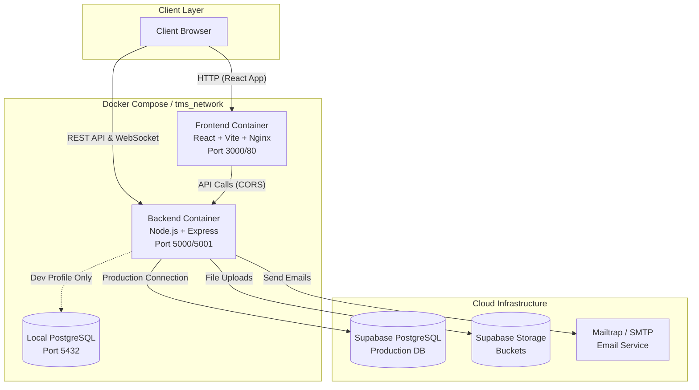

# Deployment Diagram

This document details the Docker-based deployment strategy and infrastructure topology for the Task Management System.

## Architecture Diagram



## Components Breakdown

### 1. Frontend Service (React + Nginx)
- **Container**: `tms_frontend`
- **Build**: Multi-stage build compiling React/Vite into static assets.
- **Server**: Served statically using Nginx.
- **Port**: Exposed on port `3000` (mapped to internal `80`).

### 2. Backend Service (Node.js API)
- **Container**: `tms_backend`
- **Framework**: Express.js
- **Port**: Exposed on port `5000` (or `5001` based on env).
- **Responsibilities**: REST API handling, Prisma ORM operations, Socket.IO server, Auth logic.

### 3. Database Layer (Development vs Production)
- **Development Profile (`local-db`)**: Spin up `tms_postgres` using the official PostgreSQL alpine image. This is only utilized during local testing.
- **Production Environment**: The backend bypasses the local DB and connects directly to **Supabase PostgreSQL** via the `DATABASE_URL` environment variable.

### 4. External Services
- **Supabase Storage**: Buckets used to handle file uploads, completely offloading binary file management from the Node container.
- **SMTP/Mailtrap**: Used for sending transactional emails (onboarding, password resets).

## Docker Compose Configuration
The `docker-compose.yml` uses profiles to manage environments:
```bash
# Start Production (Supabase connection)
docker compose up --build

# Start Local Development (Spin up local PostgreSQL)
docker compose --profile local-db up --build
```
