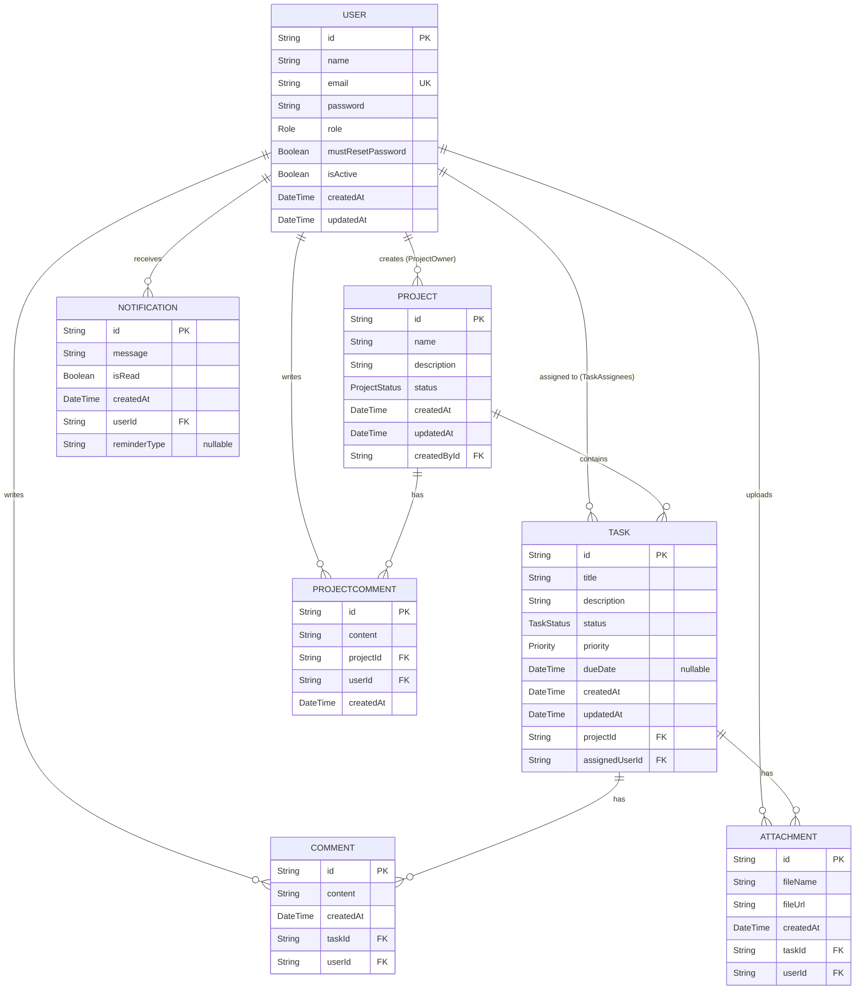

# Task Management System - Entity Relationship Diagram (ERD)

This diagram and documentation represent the exact database structure derived from the `schema.prisma` implementation.

## ER Diagram

## Entities & Relationships

### 1. User
The core entity representing individuals in the system.
- **Primary Key**: `id`
- **Relationships**:
  - 1-to-Many with `Project` (A user can own many projects).
  - 1-to-Many with `Task` (A user can be assigned many tasks).
  - 1-to-Many with `Comment` (A user can write many task comments).
  - 1-to-Many with `ProjectComment` (A user can write many project comments).
  - 1-to-Many with `Attachment` (A user can upload many attachments).
  - 1-to-Many with `Notification` (A user can receive many notifications).

### 2. Project
A high-level container for tasks.
- **Primary Key**: `id`
- **Foreign Keys**: `createdById` references `User(id)`.
- **Relationships**:
  - 1-to-Many with `Task` (A project contains many tasks).
  - 1-to-Many with `ProjectComment` (A project has many project-level comments).

### 3. Task
Actionable items assigned to users within a project.
- **Primary Key**: `id`
- **Foreign Keys**: 
  - `projectId` references `Project(id)` (On Delete: Cascade).
  - `assignedUserId` references `User(id)` (On Delete: Cascade).
- **Relationships**:
  - 1-to-Many with `Comment` (A task has many task-level comments).
  - 1-to-Many with `Attachment` (A task can have many attachments).

### 4. Comment (Task Discussions)
Messages associated with a specific task.
- **Primary Key**: `id`
- **Foreign Keys**:
  - `taskId` references `Task(id)` (On Delete: Cascade).
  - `userId` references `User(id)` (On Delete: Cascade).

### 5. ProjectComment (Project Discussions)
High-level discussions attached to an entire project.
- **Primary Key**: `id`
- **Foreign Keys**:
  - `projectId` references `Project(id)`.
  - `userId` references `User(id)`.

### 6. Attachment
Files uploaded and linked to specific tasks.
- **Primary Key**: `id`
- **Foreign Keys**:
  - `taskId` references `Task(id)` (On Delete: Cascade).
  - `userId` references `User(id)` (On Delete: Cascade).

### 7. Notification
Real-time or system alerts sent to users.
- **Primary Key**: `id`
- **Foreign Keys**:
  - `userId` references `User(id)` (On Delete: Cascade).

## Cardinality & Constraints
- Cascading deletes are enforced on `Task`, `Comment`, `Attachment`, and `Notification` to prevent orphaned records when a parent `Project` or `User` is deleted.
- Users have a unique constraint on `email`.
