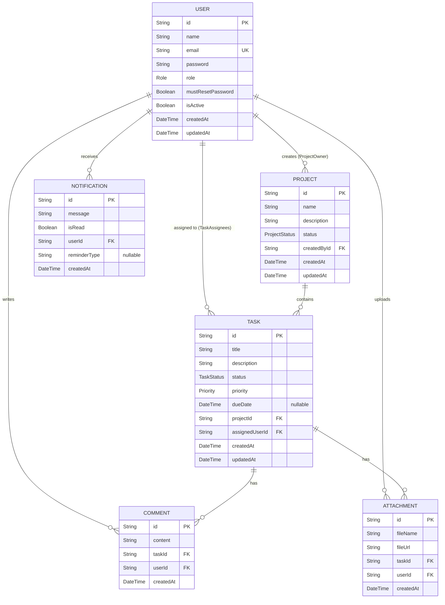

# ER Diagram — Task Management System

Generated exclusively from `backend/prisma/schema.prisma`.

> **Note:** The `ProjectComment` model exists in the Prisma schema file but has no active routes, controllers, or services wired to it. It is a residual schema artifact with no functional API surface.

---

## Entity Relationship Diagram



---

## Entities

### User

Represents a system user. All system access is controlled by the `role` field.

| Column | Type | Constraints | Description |
|---|---|---|---|
| `id` | String (UUID) | PK, default uuid() | Unique identifier |
| `name` | String | NOT NULL | Display name |
| `email` | String | NOT NULL, UNIQUE | Login email address |
| `password` | String | NOT NULL | bcrypt-hashed password |
| `role` | Enum (Role) | NOT NULL, default COLLABORATOR | System role |
| `mustResetPassword` | Boolean | NOT NULL, default true | Forces password change on first login |
| `isActive` | Boolean | NOT NULL, default true | Soft deactivation flag |
| `createdAt` | DateTime | NOT NULL, default now() | Record creation timestamp |
| `updatedAt` | DateTime | NOT NULL, auto-update | Last update timestamp |

**Role Enum values:** `ADMINISTRATOR`, `PROJECT_MANAGER`, `COLLABORATOR`

---

### Project

Represents a top-level container for tasks.

| Column | Type | Constraints | Description |
|---|---|---|---|
| `id` | String (UUID) | PK, default uuid() | Unique identifier |
| `name` | String | NOT NULL | Project name (min 3 chars enforced in controller) |
| `description` | String | NULLABLE | Optional description |
| `status` | Enum (ProjectStatus) | NOT NULL, default PLANNING | Project lifecycle stage |
| `createdById` | String (UUID) | NOT NULL, FK → User.id | Project owner |
| `createdAt` | DateTime | NOT NULL, default now() | Creation timestamp |
| `updatedAt` | DateTime | NOT NULL, auto-update | Last update timestamp |

**ProjectStatus Enum values:** `PLANNING`, `IN_PROGRESS`, `ACTIVE`, `COMPLETED`

---

### Task

Represents a unit of work within a project.

| Column | Type | Constraints | Description |
|---|---|---|---|
| `id` | String (UUID) | PK, default uuid() | Unique identifier |
| `title` | String | NOT NULL | Task title |
| `description` | String | NULLABLE | Optional description |
| `status` | Enum (TaskStatus) | NOT NULL, default TODO | Current status |
| `priority` | Enum (Priority) | NOT NULL, default MEDIUM | Priority level |
| `dueDate` | DateTime | NULLABLE | Optional due date |
| `projectId` | String (UUID) | NOT NULL, FK → Project.id | Parent project |
| `assignedUserId` | String (UUID) | NOT NULL, FK → User.id | Responsible user |
| `createdAt` | DateTime | NOT NULL, default now() | Creation timestamp |
| `updatedAt` | DateTime | NOT NULL, auto-update | Last update timestamp |

**TaskStatus Enum values:** `TODO`, `IN_PROGRESS`, `COMPLETED`

**Priority Enum values:** `LOW`, `MEDIUM`, `HIGH`

**Indexes:** `@@index([projectId])`, `@@index([assignedUserId])`

---

### Comment

Represents a discussion message on a task.

| Column | Type | Constraints | Description |
|---|---|---|---|
| `id` | String (UUID) | PK, default uuid() | Unique identifier |
| `content` | String | NOT NULL | Comment text |
| `taskId` | String (UUID) | NOT NULL, FK → Task.id | Associated task |
| `userId` | String (UUID) | NOT NULL, FK → User.id | Comment author |
| `createdAt` | DateTime | NOT NULL, default now() | Creation timestamp |

---

### Attachment

Represents file metadata for files stored in Supabase Storage.

| Column | Type | Constraints | Description |
|---|---|---|---|
| `id` | String (UUID) | PK, default uuid() | Unique identifier |
| `fileName` | String | NOT NULL | Original file name as uploaded |
| `fileUrl` | String | NOT NULL | Public Supabase Storage URL |
| `taskId` | String (UUID) | NOT NULL, FK → Task.id | Associated task |
| `userId` | String (UUID) | NOT NULL, FK → User.id | Uploader |
| `createdAt` | DateTime | NOT NULL, default now() | Upload timestamp |

---

### Notification

Represents an in-app notification for a user.

| Column | Type | Constraints | Description |
|---|---|---|---|
| `id` | String (UUID) | PK, default uuid() | Unique identifier |
| `message` | String | NOT NULL | Notification text |
| `isRead` | Boolean | NOT NULL, default false | Read/unread flag |
| `userId` | String (UUID) | NOT NULL, FK → User.id | Recipient user |
| `reminderType` | String | NULLABLE | Optional reminder type label |
| `createdAt` | DateTime | NOT NULL, default now() | Creation timestamp |

**Index:** `@@index([userId])`

---

## Relationships

| From | To | Type | Description |
|---|---|---|---|
| User | Project | One-to-Many (owner) | A User (PROJECT_MANAGER) owns many Projects |
| Project | Task | One-to-Many | A Project contains many Tasks (cascade delete) |
| User | Task | One-to-Many (assigned) | A User is assigned to many Tasks (cascade delete) |
| Task | Comment | One-to-Many | A Task has many Comments (cascade delete) |
| User | Comment | One-to-Many | A User authors many Comments (cascade delete) |
| Task | Attachment | One-to-Many | A Task has many Attachments (cascade delete) |
| User | Attachment | One-to-Many | A User uploads many Attachments (cascade delete) |
| User | Notification | One-to-Many | A User receives many Notifications (cascade delete) |

---

## Cardinality Summary

```
User       ||--o{ Project      : "owns (createdBy)"
Project    ||--o{ Task         : "contains"
User       ||--o{ Task         : "assigned to"
Task       ||--o{ Comment      : "has"
User       ||--o{ Comment      : "authors"
Task       ||--o{ Attachment   : "has"
User       ||--o{ Attachment   : "uploads"
User       ||--o{ Notification : "receives"
```

---

## Cascade Delete Rules

| Parent Deleted | Cascades To |
|---|---|
| Project | All Tasks in the project |
| Task | All Comments and Attachments on the task |
| User (as assignee) | All Tasks assigned to the user |
| User (as commenter) | All Comments by the user |
| User (as uploader) | All Attachments uploaded by the user |
| User | All Notifications for the user |
